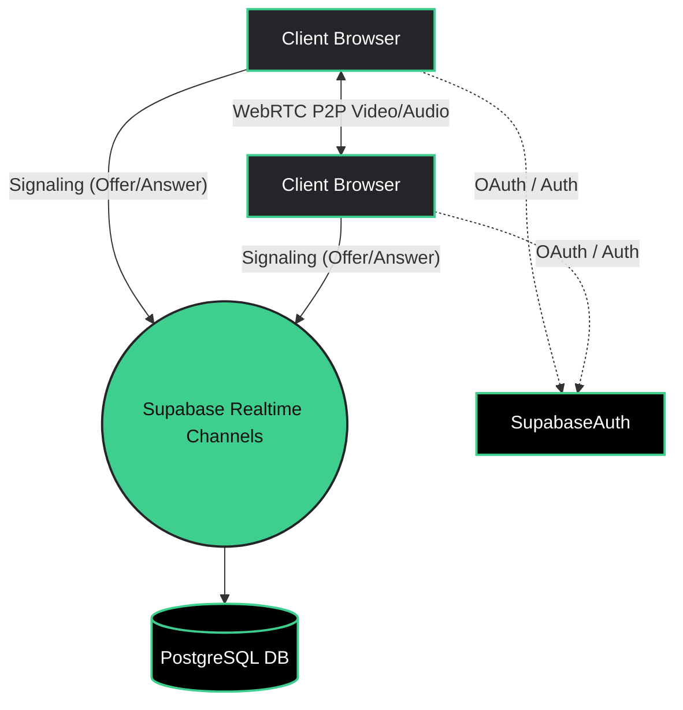

<!-- Animated Banner -->
<div align="center">
  
</div>

<!-- Typing Tagline -->
<div align="center">
  <a href="https://git.io/typing-svg">
    
  </a>
</div>

<!-- Badges Row -->
<div align="center">
  
  
  
  
</div>

<!-- Animated Divider -->
<div align="center">
  
</div>

## Table of Contents
- [Features](#features)
- [Architecture](#architecture)
- [Tech Stack](#tech-stack)
- [Setup & Installation](#setup--installation)
- [Roadmap](#roadmap)
- [Contributing](#contributing)

<!-- Animated Divider -->
<div align="center">
  
</div>

## Features

<table align="center">
  <tr>
    <td width="50%" valign="top">
      <h3>⚡ Instant P2P Rooms</h3>
      <p>Drop a link and join immediately. No native apps, no endless setup wizards. Built for modern browsers using raw WebRTC power.</p>
    </td>
    <td width="50%" align="center">
      
    </td>
  </tr>
  <tr>
    <td width="50%" align="center">
      
    </td>
    <td width="50%" valign="top">
      <h3>🔐 Glassmorphic Auth</h3>
      <p>Beautiful, ambient animated login screens powered by Supabase Google OAuth and seamless magic links.</p>
    </td>
  </tr>
</table>

## Architecture



## Tech Stack

<div align="center">
  <a href="https://skillicons.dev">
    
  </a>
</div>

<br/>

**Feature Completion Status:**
- Base Architecture & Routing <br/> 
- WebRTC P2P Video Engine <br/> 
- Google OAuth Integration <br/> 
- Live Chat & Screen Share <br/> 

## Setup & Installation

<details>
<summary><b>Click to expand setup instructions 🛠️</b></summary>

### 1. Clone the repository
```bash
git clone https://github.com/professyzenith/XY-Combinator.git
cd XY-Combinator
```

### 2. Install Dependencies
```bash
npm install
```

### 3. Set up Environment Variables
Create a `.env.local` file and add your keys:
```env
NEXT_PUBLIC_SUPABASE_URL=your_supabase_url
NEXT_PUBLIC_SUPABASE_ANON_KEY=your_supabase_anon_key
```

### 4. Ignite the Engines
```bash
npm run dev
```
Open [http://localhost:3000](http://localhost:3000) to enter the dashboard.
</details>

## Roadmap

- [x] **P2P Video Core:** Core engine setup.
- [x] **Supabase Auth:** Google Sign-in integration.
- [ ] **Screen Sharing:** High resolution screen casting.
- [ ] **Live Text Chat:** Realtime WebSocket messaging inside rooms.
- [ ] **Cloud Recording:** Instantly record and save to Supabase Storage.

## Contributing

<details>
<summary><b>Want to contribute? Click here!</b></summary>
We welcome contributions! Please open an issue first to discuss what you would like to change.
1. Fork the Project
2. Create your Feature Branch (`git checkout -b feature/AmazingFeature`)
3. Commit your Changes (`git commit -m 'Add some AmazingFeature'`)
4. Push to the Branch (`git push origin feature/AmazingFeature`)
5. Open a Pull Request
</details>

<br/>

<!-- Animated Divider -->
<div align="center">
  
</div>

<div align="center">
  <p><b>Built with passion.</b></p>
</div>
